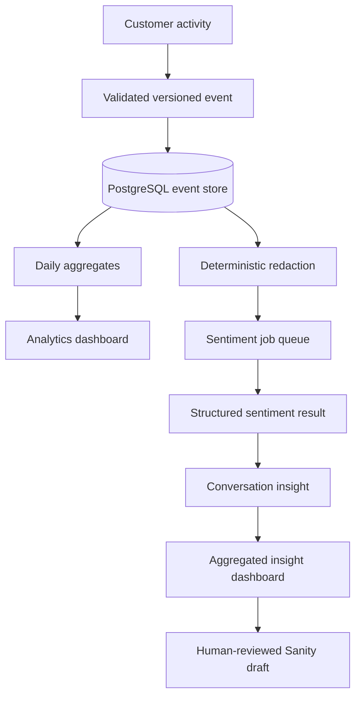

# Analytics system

## Taxonomy and consent

Version 1 events cover page/product/category/collection views; search submitted/results/clicked/zero-results; cart add/update/remove; checkout started/completed/failed; AI opened/message/tool/recommendation/feedback; and audited admin actions. Essential commerce works without optional consent. Optional rejection prevents behavioural transcript storage and sentiment jobs.

The server derives an HMAC session hash, deduplicates by event ID, and accepts only schema-listed context. AI-assisted orders require a recommendation event followed by basket addition for the same session/product inside a 24-hour window.

## Metrics

- Conversion rate: completed orders / eligible storefront sessions.
- Average order value: captured revenue / completed orders.
- Search CTR: searches with a result click / searches with results.
- Search conversion: searches attributed to a completed order / searches.
- AI recommendation click/basket rates: acted-on recommendations / shown recommendations.
- Sentiment percentage: label count / analysed conversations above the privacy threshold.
- Resolution rate: resolved / classified conversations.

Previous periods use an equal-length preceding range in `Europe/London`. Revenue uses integer minor units. Daily tables retain accessible source tables and data-quality flags.

## Sentiment, privacy, and retention

Labels are positive, neutral, negative, mixed, and uncertain. Below the configured confidence threshold, results become uncertain. Results are estimates, never sensitive-trait inference, customer ranking, pricing input, or purchase eligibility. Raw transcripts are off; redacted storage is configurable and defaults off. Text expires after 30 days and events after 365 by default. Cohorts below `ANALYTICS_K_ANONYMITY_MIN` are suppressed.

## Permissions and auditing

Admins can manage access, corrections, exports, and drafts. Analysts can view aggregates and export. Editors can create draft content suggestions. Viewing a permitted redacted conversation, correcting sentiment, exporting CSV, and creating drafts writes an audit event.

CSV exports prefix spreadsheet formula characters and enforce a maximum date range. Suggestions contain anonymised summaries only and are created with a `drafts.` Sanity ID.

## Operations

Run `pnpm analytics:worker`, `pnpm analytics:aggregate`, and `pnpm analytics:retention`. In production, schedule processing every five minutes, aggregation hourly and after midnight, and retention daily. Jobs use leases, attempts, exponential retry, and dead-letter status. Data-quality checks flag missing currency, broken attribution, aggregate drift, and invalid timestamps.

To add an event, extend the discriminated schema and documented taxonomy, then add validation and aggregation tests. To add a metric, define its denominator and attribution window first, add an accessible table alongside its chart, and backfill in bounded date chunks with reconciliation before switching reads.
