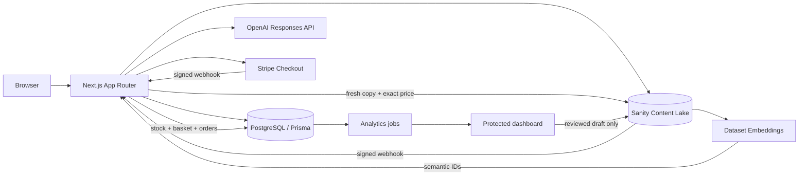

# Form & Function — AI storefront

Production-shaped Next.js ecommerce for a fictional workspace and lifestyle store. The public name, content, prices, navigation, assistant copy, SEO, and theme are modelled in Sanity; PostgreSQL models operational and analytics state. The checked-in demo catalogue and fictional aggregates let the experience run before credentials exist.

## What is included

- Responsive storefront: homepage, catalogue, categories, collections, natural-language search, product variants, persistent basket, policies, price-change handling, and checkout handoff.
- Embedded Sanity Studio at `/studio`, custom GBP editor input, structured desk navigation, preview endpoints, 12-product seed, webhook revalidation, and draft-only insight suggestions.
- Native Sanity Dataset Embeddings provider using GROQ `text::semanticSimilarity()`, targeted projections, keyword fallback, stable-ID deduplication, and fresh product/stock resolution boundary.
- Grounded shopping guide using the OpenAI Responses API, prompt-injection checks, exact integer budgets, current product cards, basket actions, feedback endpoint, and failure-safe demo responses.
- Server-priced Stripe Checkout, verified webhook boundary, idempotency model, reservations, orders, payment events, and price audits.
- Auth.js Google OAuth plus Admin/Analyst/Editor allowlists for `/admin/analytics`.
- Nine analytics views: overview, commerce, products, search, AI assistant, sentiment, conversations, content gaps, and operations. Includes accessible tables, charts, equal-period comparisons, safe CSV exports, and human-review drafts.
- Consent-aware versioned events, HMAC session hashes, deterministic PII redaction, transcript retention, k-anonymity, structured sentiment estimates, confidence handling, correction/audit models, and job leases/retries.
- Strict TypeScript, ESLint, Prettier, Vitest, Playwright, Prisma migration, Docker Compose, setup scripts, and security/analytics documentation.

## Architecture



Sanity is the source of truth for published copy and prices. PostgreSQL is the source of truth for stock, baskets, reservations, orders, payments, and analytics. Embeddings discover meaning only: price, stock, IDs, timestamps, analytics, customer details, and internal notes are excluded. Every semantic hit is re-fetched from the non-CDN Content Lake and joined with current stock. Checkout repeats that resolution and rejects stale prices.

## Local start

Requirements: Node 22+, pnpm 10+, and Docker for PostgreSQL when exercising persistence.

```bash
pnpm install
cp .env.example .env.local
docker compose up -d postgres
pnpm db:generate
pnpm db:migrate
pnpm db:seed
pnpm dev
```

Open `http://localhost:3000`, `/studio`, and `/admin/analytics`. Without external credentials the storefront and private dashboard use clearly labelled fictional data; checkout stops before payment and Studio shows setup instructions.

## Environment

Copy `.env.example`. Public values use the `NEXT_PUBLIC_` prefix. All database, OpenAI, Stripe, Auth, Sanity write/management tokens, webhook secrets, and processing secrets remain server-only and are validated by `src/lib/env.ts`. In production, use a 32-byte `AUTH_SECRET`, a high-entropy analytics processing/HMAC secret, managed PostgreSQL with TLS and backups, and scoped Sanity tokens.

## Sanity setup

1. Create a Sanity project and `production` dataset, then set `NEXT_PUBLIC_SANITY_PROJECT_ID`, dataset, API version, read/write token, and management token.
2. Add `http://localhost:3000` as a CORS origin with credentials in Sanity Manage.
3. Run `pnpm sanity:seed`; Studio remains local at `/studio`, while content is stored in Sanity Content Lake.
4. Configure Presentation/preview to call `/api/draft-mode/enable?secret=SANITY_API_READ_TOKEN&redirect=/` and disable through `/api/draft-mode/disable`.

Publishing updates Content Lake without a frontend deployment. The signed webhook invalidates tagged data and relevant paths.

### Native Dataset Embeddings

The implementation uses the current dataset-level feature, not the deprecated named Embeddings Index API.

```bash
pnpm embeddings:enable
pnpm embeddings:status
pnpm embeddings:update-projection
```

These call the dataset embeddings settings API with the projection in `src/sanity/embeddings/projection.ts`. Alternatively:

```bash
sanity datasets embeddings enable production --projection='{title,shortDescription,description,brandName,features,productFacts,materials,careInstructions,useCases,tags,searchKeywords,deliveryInformation}'
sanity datasets embeddings status production
```

Sanity manages the embedding model and asynchronously refreshes vectors. Results may briefly lag after publishing; the app falls back to keyword search. Exact product data is fetched again. Prices and stock are excluded. Customer conversations are never embedded or added to product knowledge.

### Sanity webhook

Create a webhook for create/update/delete on published `product`, `category`, `collection`, `homepage`, `faq`, `policy`, `knowledgeArticle`, `searchSynonym`, `assistantSettings`, and `siteSettings` documents:

- URL: `https://YOUR_HOST/api/webhooks/sanity`
- Secret: the value of `SANITY_WEBHOOK_SECRET`
- Projection: `{_type, "slug": slug.current}`
- Enable signed delivery and set the matching signature header expected by the route.

Test a publish and confirm a `200 {"revalidated":true}` response.

## Stripe

Set the secret/publishable keys and create a webhook:

```bash
stripe listen --forward-to localhost:3000/api/webhooks/stripe
```

Copy the printed signing secret to `STRIPE_WEBHOOK_SECRET`. In production subscribe to `checkout.session.completed`, `checkout.session.expired`, `payment_intent.payment_failed`, and refund events. Checkout generates `price_data` on the server from freshly resolved prices. A unique `PaymentEvent.providerId` makes webhook processing idempotent. Payment is never confirmed by the success redirect alone.

## Administrator authentication

1. Create a Google OAuth client with `/api/auth/callback/google` as the callback.
2. Set `AUTH_SECRET`, `AUTH_GOOGLE_ID`, and `AUTH_GOOGLE_SECRET`.
3. Add comma-separated emails to `ADMIN_EMAILS`, `ANALYST_EMAILS`, and `EDITOR_EMAILS`.
4. Restart and visit `/admin/sign-in`.

Unknown emails are rejected. Admins have all permissions; Analysts view/export permitted aggregates and redacted conversations; Editors view and create draft suggestions. Development preview is available only outside production and exposes fictional aggregates.

## Analytics, consent, and sentiment

Essential basket/order processing remains available when optional analytics is rejected. Rejection prevents behavioural transcript storage and sentiment jobs. Raw transcript storage is disabled. If `ANALYTICS_STORE_REDACTED_TRANSCRIPTS=true`, deterministic redaction runs before persistence or OpenAI analysis; text expires separately from aggregate events.

Sentiment output is strict structured data with positive, neutral, negative, mixed, or uncertain labels and confidence. Values below `ANALYTICS_SENTIMENT_CONFIDENCE_THRESHOLD` become uncertain. Sentiment is an estimate used only for aggregate service improvement—never personal pricing, eligibility, sensitive-trait inference, or individual ranking. Groups below the k-anonymity threshold are hidden.

Run locally:

```bash
pnpm analytics:seed
pnpm analytics:worker
pnpm analytics:aggregate
pnpm analytics:retention
pnpm analytics:backfill-sentiment
```

Production schedule: worker every 5 minutes, aggregate hourly and after local midnight, retention daily, and bounded backfills manually. Protect scheduled calls with `ANALYTICS_PROCESSING_SECRET`. Jobs use dedupe keys, leases, retry attempts, and dead-letter status. See `ANALYTICS.md` for event names, exact metrics, access auditing, CSV rules, and safe backfill procedure.

## Validation

```bash
pnpm format:check
pnpm lint
pnpm typecheck
pnpm test
pnpm test:e2e
pnpm build
pnpm validate
```

Automated tests mock or avoid credit-bearing OpenAI, Stripe, and Sanity operations. Playwright requires its Chromium runtime (`pnpm exec playwright install chromium`).

## Production checklist

- Provision managed PostgreSQL, run the checked-in Prisma migration, seed inventory, configure backups and reservation-release scheduling.
- Configure Sanity, embeddings, preview, CORS, tokens, webhook signatures, and Studio hostnames.
- Configure Stripe keys/webhooks and Google OAuth allowlists.
- Configure OpenAI model environment variables, rate limiting, cost alerts, and permitted transcript mode.
- Set HTTPS, CSP at the edge, log redaction, secret rotation, monitoring, and alerting.
- Run `pnpm validate` and Playwright against the deployment.
- Obtain professional accessibility, security, tax, payment, privacy, consent wording, retention, and legal reviews.

## Troubleshooting

- Studio setup page persists: set the public Sanity project/dataset and restart Next.js.
- Semantic results missing: run `pnpm embeddings:status`; keyword search remains available while status is updating.
- Checkout opens demo mode: add `STRIPE_SECRET_KEY` and restart.
- Analytics preview appears: configure Google OAuth and the email allowlists; production never enables preview.
- Prisma cannot connect: check `docker compose ps`, `DATABASE_URL`, and port 5432.

Further operational and policy detail lives in `DECISIONS.md`, `SECURITY.md`, and `ANALYTICS.md`.
